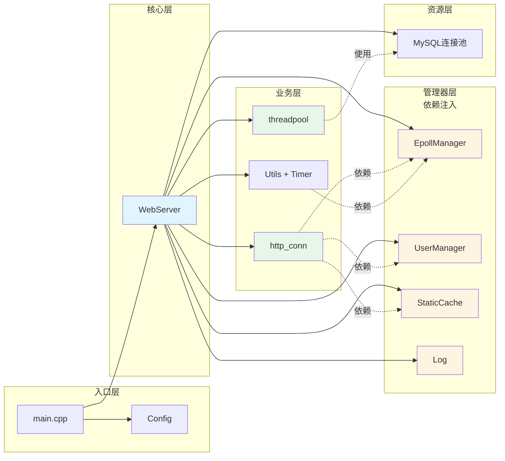
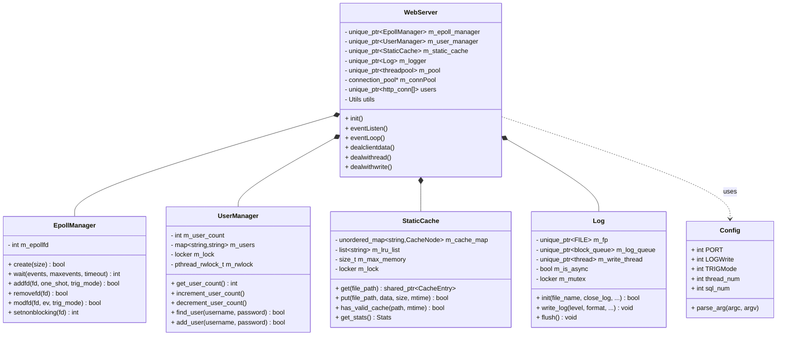
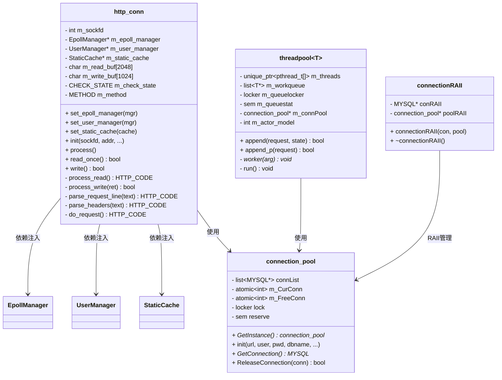
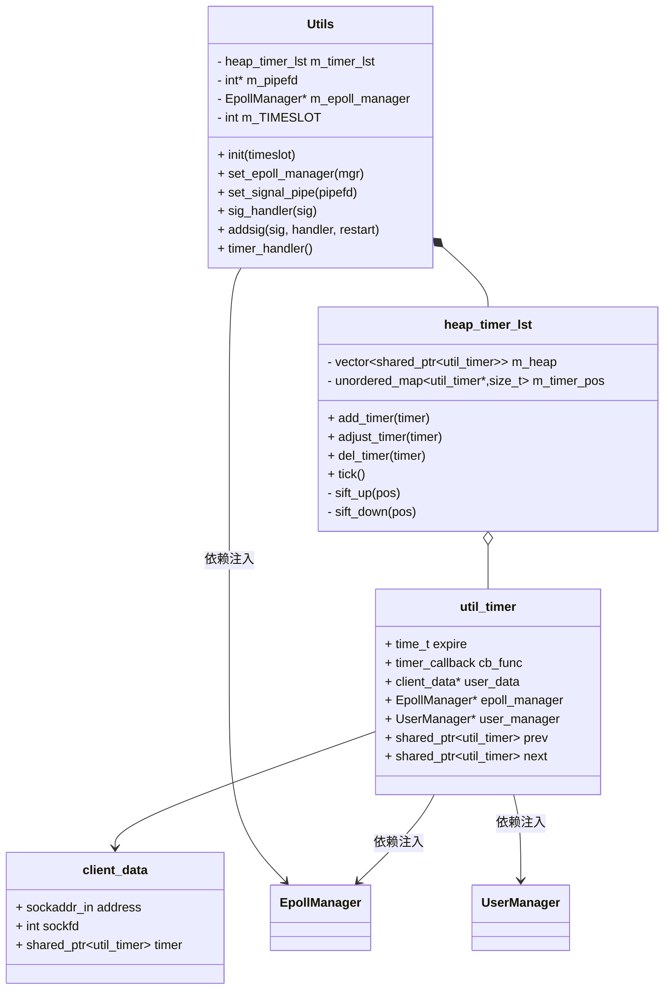
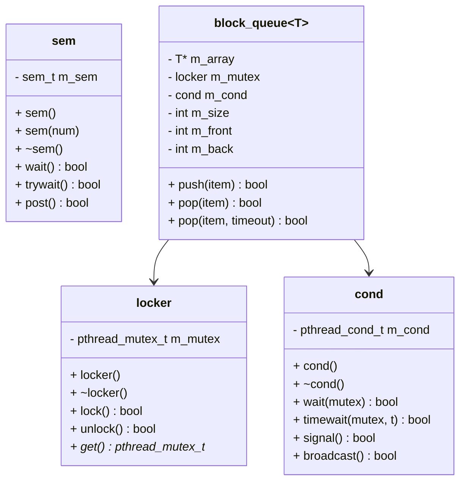
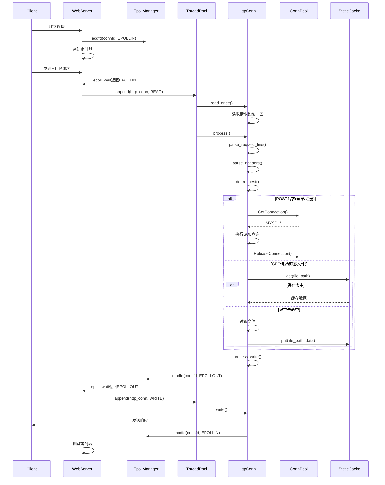

# TinyWebServer 架构文档

## 项目概述

TinyWebServer 是一个使用 C++ 实现的轻量级高性能 Web 服务器，专为 Linux 平台设计。本项目已重构为**依赖注入架构**，消除了静态耦合和全局状态，提升了可测试性和可维护性。

### 核心特性

- **高性能并发模型**：线程池 + epoll (ET/LT) + Reactor/Proactor
- **依赖注入架构**：解耦组件，消除全局状态
- **HTTP/1.1 协议支持**：状态机解析 GET/POST 请求
- **数据库集成**：MySQL 连接池 + RAII 管理
- **异步日志系统**：支持同步/异步写入
- **定时器优化**：最小堆实现，O(log n) 性能
- **静态文件缓存**：LRU 缓存 + ETag + 零拷贝
- **压测表现**：Webbench 测试 10000+ 并发连接，QPS 93k-97k

---

## 系统架构图

### 整体架构



---

## 类结构详解

### 1. 核心类关系图



### 2. HTTP 处理类关系图



### 3. 定时器系统类关系图



### 4. 同步原语类关系图



---

## 数据流图

### HTTP 请求处理流程



---

## 重构亮点

### 1. 依赖注入模式

**改造前（紧耦合）**：
```cpp
class http_conn {
    static int m_epollfd;      // 全局 epoll fd
    static int m_user_count;   // 全局用户计数
};

// 全局变量
locker m_lock;
map<string, string> users;
```

**改造后（解耦）**：
```cpp
class http_conn {
    EpollManager *m_epoll_manager;  // 依赖注入
    UserManager *m_user_manager;     // 依赖注入
    StaticCache *m_static_cache;     // 依赖注入

    void set_epoll_manager(EpollManager *mgr);
    void set_user_manager(UserManager *mgr);
    void set_static_cache(StaticCache *cache);
};
```

### 2. 智能指针管理

使用 `unique_ptr` 和 `shared_ptr` 自动管理资源生命周期：

```cpp
class WebServer {
    std::unique_ptr<EpollManager> m_epoll_manager;
    std::unique_ptr<UserManager> m_user_manager;
    std::unique_ptr<StaticCache> m_static_cache;
    std::unique_ptr<Log> m_logger;
    std::unique_ptr<threadpool<http_conn>> m_pool;
    std::unique_ptr<http_conn[]> users;
};
```

### 3. 最小堆定时器

将原有的排序链表（O(n) 插入/删除）改为最小堆（O(log n)）：

```cpp
class heap_timer_lst {
    std::vector<std::shared_ptr<util_timer>> m_heap;
    std::unordered_map<util_timer*, size_t> m_timer_pos;  // 快速索引

    void add_timer(timer);      // O(log n)
    void adjust_timer(timer);   // O(log n)
    void del_timer(timer);      // O(log n)
};
```

### 4. LRU 静态文件缓存

使用 LRU + ETag + 零拷贝优化静态文件服务：

```cpp
class StaticCache {
    unordered_map<string, CacheNode> m_cache_map;  // 快速查找
    list<string> m_lru_list;                       // LRU双向链表
    size_t m_max_memory;                           // 内存限制

    shared_ptr<CacheEntry> get(file_path);
    bool put(file_path, data, size, mtime);
};
```

---

## 并发模型

### Reactor 模式（推荐）

```
Main Thread (epoll)
    ↓
[监听新连接]
    ↓
[监听读/写事件]
    ↓
Worker Threads (线程池)
    ↓
[执行 I/O 操作 + 业务逻辑]
```

### Proactor 模式

```
Main Thread
    ↓
[I/O 操作]
    ↓
Worker Threads
    ↓
[业务逻辑]
```

---

## 性能优化技术

1. **零拷贝**：使用 `sendfile()` 减少数据拷贝
2. **批处理**：线程池一次取出多个任务，减少锁竞争
3. **原子操作**：数据库连接池计数器使用 `atomic<int>`
4. **读写锁**：用户数据查找使用 `pthread_rwlock_t`
5. **内存池**：LRU 缓存复用内存
6. **ET 模式**：边缘触发减少 epoll 调用

---

## 目录结构

```
TinyWebServer-DFP/
├── main.cpp                   # 程序入口
├── webserver.h/cpp            # WebServer核心类
├── config.h/cpp               # 配置解析
├── epoll/
│   └── epoll_manager.h/cpp    # Epoll管理器
├── user/
│   └── user_manager.h/cpp     # 用户管理器
├── cache/
│   └── static_cache.h/cpp     # LRU缓存
├── threadpool/
│   └── threadpool.h           # 线程池(模板)
├── http/
│   └── http_conn.h/cpp        # HTTP连接处理
├── CGImysql/
│   └── sql_connection_pool.h/cpp  # 数据库连接池
├── log/
│   ├── log.h/cpp              # 日志系统
│   └── block_queue.h          # 阻塞队列
├── timer/
│   └── lst_timer.h/cpp        # 定时器(最小堆)
├── lock/
│   └── locker.h               # 同步原语
├── root/                      # 静态资源
│   ├── welcome.html
│   ├── register.html
│   └── ...
└── test_pressure/             # 压测工具
    └── webbench-1.5/
```

---

## 编译与运行

### 编译

```bash
make server
```

### 运行

```bash
# 默认配置
./server

# 自定义配置
./server -p 9007 -l 1 -m 3 -t 10 -s 10 -a 1
```

### 参数说明

| 参数 | 说明 | 默认值 |
|------|------|--------|
| `-p` | 端口号 | 9006 |
| `-l` | 日志模式 (0=同步, 1=异步) | 0 |
| `-m` | 触发模式 (0=LT+LT, 1=LT+ET, 2=ET+LT, 3=ET+ET) | 0 |
| `-o` | 优雅关闭 (0=关闭, 1=开启) | 0 |
| `-s` | 数据库连接池大小 | 8 |
| `-t` | 线程池大小 | 8 |
| `-c` | 关闭日志 (0=开启, 1=关闭) | 0 |
| `-a` | 并发模型 (0=Proactor, 1=Reactor) | 0 |

---

## 压力测试

使用 Webbench 进行压测：

```bash
cd test_pressure/webbench-1.5
./webbench -c 10000 -t 60 http://localhost:9006/
```

**测试结果**：
- 并发连接：10000+
- QPS：93k-97k (Proactor + LT+ET)
- 成功率：100%

---

## 学习路径

1. **入门**：`main.cpp` → `webserver.cpp` → `config.cpp`
2. **核心**：`epoll_manager.cpp` → `http_conn.cpp` → `threadpool.h`
3. **资源管理**：`sql_connection_pool.cpp` → `log.cpp` → `static_cache.cpp`
4. **高级**：`lst_timer.cpp` (最小堆) → 零拷贝 → LRU缓存

---

## 参考资料

- 《Linux高性能服务器编程》- 游双
- [原项目](https://github.com/qinguoyi/TinyWebServer)
- [Epoll详解](https://man7.org/linux/man-pages/man7/epoll.7.html)
- [HTTP/1.1 RFC](https://www.rfc-editor.org/rfc/rfc2616)

---

## License

MIT License

---

**重构目标**：✅ 消除全局状态 | ✅ 提升可测试性 | ✅ 增强可维护性 | ✅ 支持多实例部署
