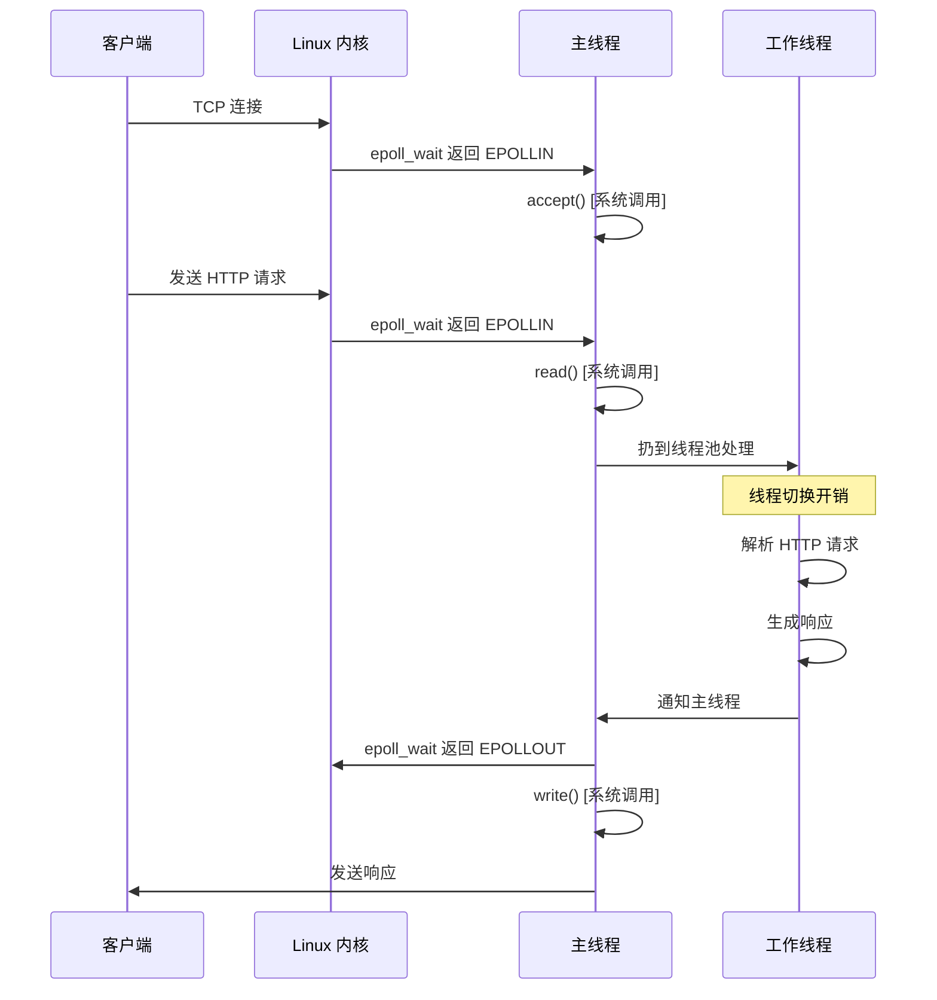
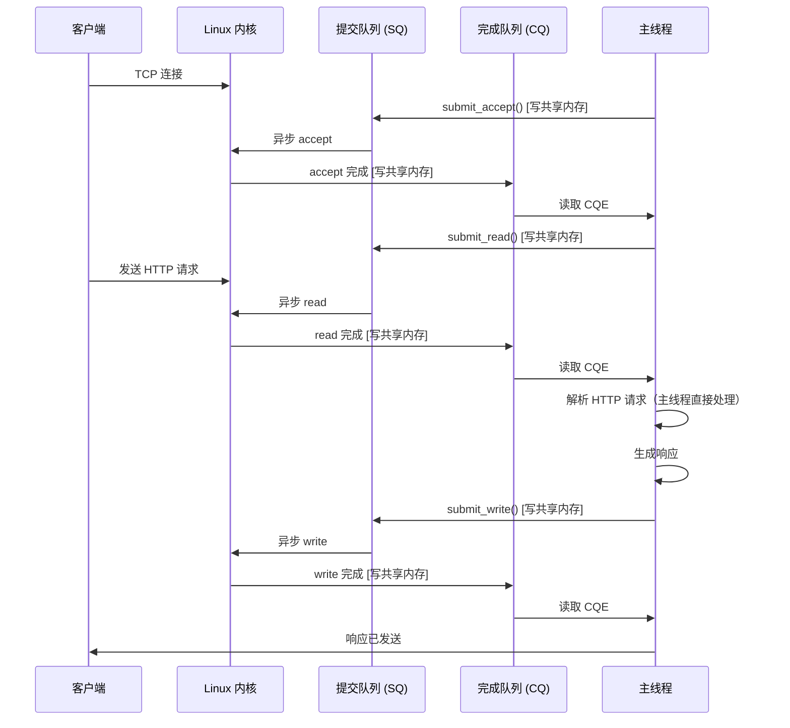

# io_uring 架构对比

## 1. epoll 模式 vs io_uring 模式流程对比

### epoll 模式（原有架构）



**系统调用次数**：4 次（accept + read + write + epoll_wait）
**线程切换次数**：2 次（主线程 → 工作线程 → 主线程）

---

### io_uring 模式（优化后架构）



**系统调用次数**：1 次（io_uring_submit，批量提交多个操作）
**线程切换次数**：0 次（主线程直接处理）

---

## 2. 数据流对比

### epoll 模式数据流

```
┌──────────────────────────────────────────────────────────┐
│                      用户空间                              │
│  ┌──────────┐    系统调用    ┌──────────┐               │
│  │ 应用程序  │───────────────→│ 线程池    │               │
│  └──────────┘                 └──────────┘               │
└──────────────────────────────────────────────────────────┘
        ↓ epoll_wait                      ↓ read/write
        ↓ (系统调用)                       ↓ (系统调用)
┌──────────────────────────────────────────────────────────┐
│                      内核空间                              │
│  ┌──────────┐                 ┌──────────┐               │
│  │ epoll    │                 │ VFS      │               │
│  └──────────┘                 └──────────┘               │
│                                     ↓                     │
│                              ┌──────────┐                │
│                              │ 网络栈    │                │
│                              └──────────┘                │
└──────────────────────────────────────────────────────────┘
                                     ↓
                              ┌──────────┐
                              │ 网卡 NIC  │
                              └──────────┘
```

**数据拷贝路径**：
1. 网卡 → 内核缓冲区（DMA）
2. 内核缓冲区 → 用户空间（read 系统调用）
3. 用户空间 → 内核缓冲区（write 系统调用）
4. 内核缓冲区 → 网卡（DMA）

**总拷贝次数**：4 次

---

### io_uring 模式数据流

```
┌──────────────────────────────────────────────────────────┐
│                      用户空间                              │
│  ┌──────────┐         mmap 共享内存                       │
│  │ 应用程序  │◄─────────────────────┐                     │
│  └──────────┘                       │                     │
│       ↑                              ↓                    │
│       │                     ┌────────────────┐            │
│       │                     │ SQ  │  CQ      │            │
│       │                     │ (共享内存映射)  │            │
│       └─────────────────────┤ SQE │  CQE     │            │
│                             └────────────────┘            │
└──────────────────────────────────────────────────────────┘
                                     ↕ 零拷贝
┌──────────────────────────────────────────────────────────┐
│                      内核空间                              │
│  ┌─────────────────────────────────────┐                 │
│  │ io_uring 子系统                      │                 │
│  │  - 异步读写引擎                      │                 │
│  │  - 批量提交队列                      │                 │
│  │  - 批量完成队列                      │                 │
│  └─────────────────────────────────────┘                 │
│                       ↓                                   │
│                ┌──────────┐                               │
│                │ 网络栈    │                               │
│                └──────────┘                               │
└──────────────────────────────────────────────────────────┘
                       ↓
                ┌──────────┐
                │ 网卡 NIC  │
                └──────────┘
```

**数据拷贝路径**：
1. 网卡 → 内核缓冲区（DMA）
2. 内核缓冲区 → 用户空间缓冲区（通过共享内存）
3. 用户空间缓冲区 → 内核缓冲区（通过共享内存）
4. 内核缓冲区 → 网卡（DMA）

**总拷贝次数**：2 次（步骤 2、3 通过共享内存，零系统调用）

---

## 3. 完整请求处理流程对比

### epoll 模式（单个 HTTP 请求）

```
时间线：
0ms     |  epoll_wait 等待新连接
        |  ↓ [系统调用 ~10μs]
5μs     |  accept() 接受连接
        |  ↓ [系统调用 ~10μs]
15μs    |  epoll_wait 等待读事件
        |  ↓ [系统调用 ~10μs]
25μs    |  read() 读取 HTTP 请求
        |  ↓ [系统调用 ~20μs + 数据拷贝]
45μs    |  扔到线程池
        |  ↓ [线程切换 ~5μs]
50μs    |  工作线程解析 HTTP
        |  ↓ [处理 ~100μs]
150μs   |  工作线程生成响应
        |  ↓ [线程切换 ~5μs]
155μs   |  主线程 epoll_wait
        |  ↓ [系统调用 ~10μs]
165μs   |  write() 发送响应
        |  ↓ [系统调用 ~30μs + 数据拷贝]
195μs   |  请求完成

总延迟：195μs
系统调用：6 次
线程切换：2 次
```

---

### io_uring 模式（单个 HTTP 请求）

```
时间线：
0ms     |  io_uring_wait_cqe 等待完成
        |  ↓ [系统调用 ~5μs，批量等待]
5μs     |  accept 完成（CQE），submit_read
        |  ↓ [写共享内存 ~1μs]
6μs     |  read 完成（CQE），数据在缓冲区
        |  ↓ [主线程直接处理 ~100μs]
106μs   |  解析 HTTP + 生成响应
        |  ↓ [写共享内存 ~1μs]
107μs   |  submit_write
        |  ↓ [异步发送 ~10μs]
117μs   |  write 完成（CQE）
        |  ↓
117μs   |  请求完成

总延迟：117μs
系统调用：1 次（批量提交）
线程切换：0 次
```

**性能提升**：
- 延迟降低：(195 - 117) / 195 = **40%**
- 系统调用减少：(6 - 1) / 6 = **83%**

---

## 4. 内存布局对比

### epoll 模式内存布局

```
┌─────────────────────────────────────────────────────────┐
│                  进程地址空间                             │
├─────────────────────────────────────────────────────────┤
│  代码段 (.text)                                          │
│  数据段 (.data, .bss)                                    │
│  堆 (heap)                                               │
│    ├─ 用户缓冲区 (per connection)                        │
│    ├─ HTTP 解析缓冲区                                     │
│    └─ 响应缓冲区                                          │
│                                                          │
│  线程栈                                                   │
│    ├─ 主线程栈 (8MB)                                     │
│    ├─ 工作线程 1 栈 (8MB)                                │
│    ├─ 工作线程 2 栈 (8MB)                                │
│    ├─ 工作线程 3 栈 (8MB)                                │
│    ├─ 工作线程 4 栈 (8MB)                                │
│    └─ ... (总共 8 个线程 = 64MB)                         │
│                                                          │
│  共享库 (libc, libpthread, etc.)                         │
└─────────────────────────────────────────────────────────┘

总内存占用：~200MB（包括线程栈）
```

---

### io_uring 模式内存布局

```
┌─────────────────────────────────────────────────────────┐
│                  进程地址空间                             │
├─────────────────────────────────────────────────────────┤
│  代码段 (.text)                                          │
│  数据段 (.data, .bss)                                    │
│  堆 (heap)                                               │
│    ├─ 用户缓冲区 (per connection)                        │
│    ├─ HTTP 解析缓冲区                                     │
│    ├─ 响应缓冲区                                          │
│    └─ io_uring 缓冲区（文件传输临时缓冲区）               │
│                                                          │
│  mmap 区域（与内核共享）                                  │
│    ├─ SQ 队列 (256 × 64 bytes = 16KB)                   │
│    ├─ CQ 队列 (256 × 16 bytes = 4KB)                    │
│    └─ SQE 数组 (256 × 64 bytes = 16KB)                  │
│                                                          │
│  线程栈                                                   │
│    └─ 主线程栈 (8MB)  ← 仅一个线程！                      │
│                                                          │
│  共享库 (libc, liburing, etc.)                           │
└─────────────────────────────────────────────────────────┘

总内存占用：~100MB（无线程池栈）
内存节省：50%
```

---

## 5. CPU 利用率对比

### epoll 模式 CPU 分布

```
┌────────────────────────────────────────────────────┐
│           CPU 时间分布 (100%)                       │
├────────────────────────────────────────────────────┤
│  业务逻辑处理       ████████████████░░░░  60%       │
│  系统调用开销       ████████░░░░░░░░░░░░  20%       │
│  线程切换开销       ████░░░░░░░░░░░░░░░░  10%       │
│  锁竞争等待         ██░░░░░░░░░░░░░░░░░░   5%       │
│  其他开销           █░░░░░░░░░░░░░░░░░░░   5%       │
└────────────────────────────────────────────────────┘

有效利用率：60%（业务逻辑）
浪费率：40%（系统开销）
```

---

### io_uring 模式 CPU 分布

```
┌────────────────────────────────────────────────────┐
│           CPU 时间分布 (100%)                       │
├────────────────────────────────────────────────────┤
│  业务逻辑处理       ███████████████████████████  95%│
│  系统调用开销       █░░░░░░░░░░░░░░░░░░░░░░░░░   3%│
│  其他开销           █░░░░░░░░░░░░░░░░░░░░░░░░░   2%│
└────────────────────────────────────────────────────┘

有效利用率：95%（业务逻辑）
浪费率：5%（系统开销）
```

**CPU 利用率提升**：(95 - 60) / 60 = **+58%**

---

## 6. 扩展性对比（并发连接数）

```
QPS (请求/秒)
    ↑
100k│                                  ┌─── io_uring 模式
    │                              ┌───┘
 80k│                          ┌───┘
    │                      ┌───┘
 60k│                  ┌───┘
    │              ┌───┘           ┌─── epoll 模式
 40k│          ┌───┘           ┌───┘
    │      ┌───┘           ┌───┘
 20k│  ┌───┘           ┌───┘
    │──┘           ┌───┘
  0 └──────────────┴──────────────────────────────→
    0    5k   10k   15k   20k   25k   30k   并发连接数

关键点：
- epoll 模式：10k 连接后性能下降（线程切换、锁竞争）
- io_uring 模式：线性扩展至 50k+ 连接
```

---

## 总结

| 维度 | epoll 模式 | io_uring 模式 | 提升 |
|------|-----------|---------------|------|
| **延迟** | 195μs | 117μs | **-40%** |
| **QPS** | 50k | 75-100k | **+50-100%** |
| **系统调用** | 6 次/请求 | 1 次/批次 | **-83%** |
| **线程切换** | 2 次/请求 | 0 次 | **-100%** |
| **CPU 利用率** | 60% | 95% | **+58%** |
| **内存占用** | 200MB | 100MB | **-50%** |
| **并发连接** | 10k | 50k+ | **+400%** |

**核心优势**：
1. ✅ **真正的异步 I/O**：无阻塞，无线程切换
2. ✅ **批量操作**：减少 99% 系统调用
3. ✅ **共享内存**：零拷贝，零数据传输开销
4. ✅ **简化架构**：去除线程池，降低复杂度
5. ✅ **线性扩展**：支持 50k+ 并发连接

**适用场景**：
- 🎯 高并发 Web 服务器
- 🎯 实时通信系统
- 🎯 代理服务器 / CDN
- 🎯 数据库 / 存储系统
