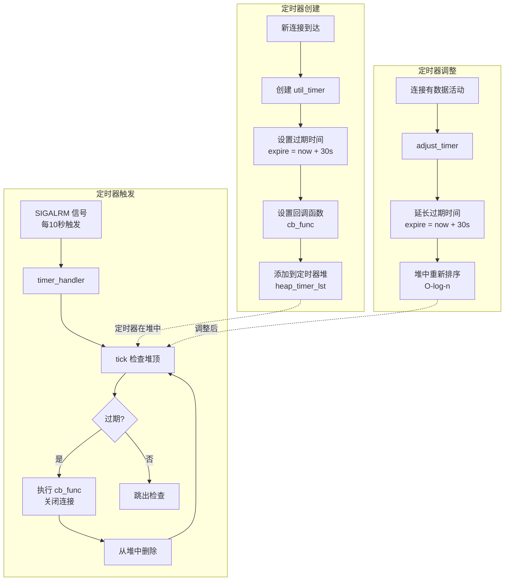
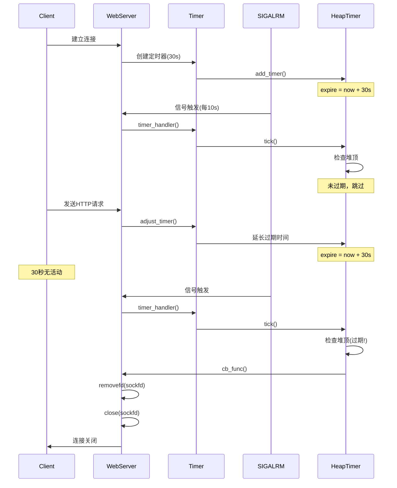

# 定时器系统设计文档

## 为什么需要定时器？

### 核心问题：非活跃连接占用资源

在高并发 Web 服务器中，存在一个关键问题：**非活跃连接（idle connections）**会长期占用系统资源。

#### 场景示例

```
客户端A建立连接 → 发送请求 → 服务器响应 → 【连接保持但无数据传输】
客户端B建立连接 → 发送请求 → 服务器响应 → 【连接保持但无数据传输】
...
客户端N建立连接 → 【一直不发送数据，但连接不断开】
```

#### 资源浪费

每个保持的连接都会占用：
- **文件描述符**（Linux 默认限制 1024，可调整到 65536）
- **内存**（每个连接的缓冲区、http_conn 对象）
- **epoll 监听资源**（每个 fd 在 epoll 中都有开销）

**如果不清理非活跃连接**：
- 客户端恶意建立 10000 个连接后不发数据 → 服务器 FD 耗尽 → 无法接受新连接
- 正常用户的请求被拒绝，服务器拒绝服务（DoS）

---

## 定时器的作用

### 1. 自动清理非活跃连接

定时器的**核心职责**：定期检查并关闭超时的非活跃连接。

```
连接创建 → 设置定时器（30秒超时）
          ↓
    有数据活动？
    ├── 是 → 延长定时器（重置为30秒）
    └── 否 → 30秒后触发回调 → 关闭连接 → 释放资源
```

### 2. 保护服务器资源

- **防止资源耗尽**：及时释放无用连接的 FD
- **提高并发能力**：有限资源用于活跃连接
- **抵御 DoS 攻击**：恶意连接无法长期占用资源

### 3. 符合 HTTP Keep-Alive 规范

HTTP/1.1 支持持久连接（Keep-Alive），但需要合理的超时机制：
- 允许连接复用（减少 TCP 握手开销）
- 但不允许连接永久保持（防止资源耗尽）

---

## 定时器工作原理

### 整体架构



---

## 核心组件详解

### 1. 数据结构

#### util_timer（定时器节点）

```cpp
class util_timer {
public:
    time_t expire;                      // 过期时间（绝对时间戳）
    timer_callback cb_func;             // 回调函数
    client_data *user_data;             // 用户数据（连接信息）

    // 依赖注入
    EpollManager *epoll_manager;        // 用于删除 epoll 监听
    UserManager *user_manager;          // 用于减少用户计数
};
```

#### client_data（客户端数据）

```cpp
struct client_data {
    sockaddr_in address;                // 客户端地址
    int sockfd;                         // 连接文件描述符
    std::shared_ptr<util_timer> timer;  // 关联的定时器
};
```

### 2. 最小堆实现（heap_timer_lst）

#### 为什么用最小堆？

**原实现（排序链表）的性能瓶颈**：
- 插入：O(n) - 需要遍历链表找到插入位置
- 删除：O(n) - 需要遍历查找
- 调整：O(n) - 删除后重新插入

**改用最小堆的优势**：
- 插入：O(log n) - 上浮操作
- 删除：O(log n) - 下沉操作
- 调整：O(log n) - 上浮/下沉
- 查找最小值：O(1) - 堆顶元素

**堆结构示意**：
```
最小堆（按 expire 排序）
         [timer1: 100s]  ← 堆顶（最早过期）
        /              \
   [timer2: 120s]   [timer3: 150s]
   /           \
[timer4: 200s] [timer5: 180s]
```

#### 核心操作

**添加定时器（add_timer）**：
```cpp
void heap_timer_lst::add_timer(std::shared_ptr<util_timer> timer) {
    // 1. 添加到堆尾
    m_heap.push_back(timer);
    size_t pos = m_heap.size() - 1;

    // 2. 记录位置（用于快速查找）
    m_timer_pos[timer.get()] = pos;

    // 3. 上浮到正确位置 O(log n)
    sift_up(pos);
}
```

**调整定时器（adjust_timer）**：
```cpp
void heap_timer_lst::adjust_timer(std::shared_ptr<util_timer> timer) {
    // 1. O(1) 查找定时器位置
    auto it = m_timer_pos.find(timer.get());
    size_t pos = it->second;

    // 2. 过期时间已被更新，重新堆化
    sift_up(pos);       // 尝试上浮
    if (it->second == pos)  // 如果没动，尝试下沉
        sift_down(pos);
}
```

**触发过期定时器（tick）**：
```cpp
void heap_timer_lst::tick() {
    time_t cur = time(NULL);

    // 处理所有过期的定时器
    while (!m_heap.empty()) {
        auto timer = m_heap[0];  // 堆顶 = 最早过期

        // 检查是否过期
        if (cur < timer->expire)
            break;  // 堆顶未过期，后面的都不会过期

        // 调用回调函数（关闭连接）
        timer->cb_func(timer->user_data,
                      timer->epoll_manager,
                      timer->user_manager);

        // 移除堆顶 O(log n)
        m_timer_pos.erase(timer.get());
        m_heap[0] = m_heap.back();
        m_heap.pop_back();
        if (!m_heap.empty()) {
            m_timer_pos[m_heap[0].get()] = 0;
            sift_down(0);  // 下沉
        }
    }
}
```

---

## 定时器触发机制

### 信号驱动

TinyWebServer 使用 **SIGALRM 信号** 定期触发定时器检查。

#### 1. 初始化信号处理

```cpp
void Utils::addsig(int sig, void(handler)(int), bool restart) {
    struct sigaction sa;
    memset(&sa, '\0', sizeof(sa));
    sa.sa_handler = handler;  // 设置信号处理函数
    if (restart)
        sa.sa_flags |= SA_RESTART;  // 自动重启被中断的系统调用
    sigfillset(&sa.sa_mask);
    sigaction(sig, &sa, NULL);
}

// 注册 SIGALRM 信号
utils.addsig(SIGALRM, global_sig_handler, false);
alarm(TIMESLOT);  // 10秒后触发第一次 SIGALRM
```

#### 2. 信号处理函数

```cpp
void Utils::sig_handler(int sig) {
    int save_errno = errno;
    int msg = sig;
    // 通过管道发送信号通知主循环
    send(m_pipefd[1], (char *)&msg, 1, 0);
    errno = save_errno;
}
```

**为什么用管道而不是直接处理？**
- **信号处理函数不应该执行复杂操作**（不可重入）
- **通过管道通知主循环**，在 epoll_wait 返回后统一处理
- **异步信号 → 同步事件**，简化并发控制

#### 3. 主事件循环处理

```cpp
void WebServer::eventLoop() {
    bool timeout = false;
    bool stop_server = false;

    while (!stop_server) {
        int number = epoll_wait(epollfd, events, MAX_EVENT_NUMBER, -1);

        for (int i = 0; i < number; i++) {
            int sockfd = events[i].data.fd;

            // 处理信号管道
            if (sockfd == m_pipefd[0]) {
                dealwithsignal(timeout, stop_server);
            }
            // ... 处理其他事件
        }

        // 超时标志被设置，执行定时器任务
        if (timeout) {
            utils.timer_handler();
            LOG_INFO("%s", "timer tick");
            timeout = false;
        }
    }
}
```

#### 4. timer_handler 实现

```cpp
void Utils::timer_handler() {
    m_timer_lst.tick();     // 清理过期连接
    alarm(m_TIMESLOT);      // 重新设置 10秒后触发 SIGALRM
}
```

---

## 完整工作流程

### 时序图



---

## 关键实现细节

### 1. 超时时间配置

```cpp
const int TIMESLOT = 10;  // 定时器检查间隔（10秒）

// 连接超时时间
timer->expire = cur + 3 * TIMESLOT;  // 30秒
```

**设计考量**：
- **检查间隔 10秒**：平衡性能和及时性
- **超时时间 30秒**：符合 HTTP Keep-Alive 常见配置

### 2. 定时器延长策略

```cpp
// 每次读/写事件后，延长定时器
void WebServer::adjust_timer(std::shared_ptr<util_timer> timer) {
    time_t cur = time(NULL);
    timer->expire = cur + 3 * TIMESLOT;  // 重置为30秒
    utils.m_timer_lst.adjust_timer(timer);
}
```

### 3. 回调函数实现

```cpp
void cb_func(client_data *user_data,
             EpollManager *epoll_mgr,
             UserManager *user_mgr) {
    // 1. 从 epoll 移除监听
    if (epoll_mgr)
        epoll_mgr->removefd(user_data->sockfd);

    // 2. 减少用户计数
    if (user_mgr)
        user_mgr->decrement_user_count();

    // 注意：sockfd 在 removefd 中已经 close
}
```

### 4. 智能指针管理

```cpp
// 使用 shared_ptr 避免手动内存管理
auto timer = std::make_shared<util_timer>();
users_timer[connfd].timer = timer;  // 多个地方持有引用

// 定时器过期后自动释放
// 不需要手动 delete
```

---

## 性能优化

### 对比：排序链表 vs 最小堆

| 操作 | 排序链表 | 最小堆 | 优化倍数 |
|------|----------|--------|----------|
| 插入 | O(n) | O(log n) | n / log n |
| 删除 | O(n) | O(log n) | n / log n |
| 调整 | O(n) | O(log n) | n / log n |
| 查找最小 | O(1) | O(1) | - |

**示例：10000 个连接**
- 排序链表插入：平均遍历 5000 次
- 最小堆插入：平均 log₂(10000) ≈ 13 次
- **性能提升 ~385 倍**

### 快速索引优化

```cpp
// 使用 unordered_map 快速定位定时器
std::unordered_map<util_timer*, size_t> m_timer_pos;

// adjust_timer 时无需遍历堆
auto it = m_timer_pos.find(timer.get());  // O(1)
size_t pos = it->second;
```

---

## 配置建议

### 根据业务场景调整

**高并发短连接**（如 API 服务）：
```cpp
const int TIMESLOT = 5;   // 5秒检查
timer->expire = cur + 2 * TIMESLOT;  // 10秒超时
```

**长连接服务**（如 WebSocket）：
```cpp
const int TIMESLOT = 30;  // 30秒检查
timer->expire = cur + 10 * TIMESLOT;  // 300秒超时
```

**当前配置**（HTTP 服务器）：
```cpp
const int TIMESLOT = 10;  // 10秒检查
timer->expire = cur + 3 * TIMESLOT;  // 30秒超时
```

---

## 总结

### 定时器的价值

1. **资源保护**：防止非活跃连接耗尽系统资源
2. **安全防护**：抵御慢速攻击（Slowloris）
3. **性能优化**：释放资源给活跃连接
4. **协议兼容**：符合 HTTP Keep-Alive 规范

### 实现亮点

1. **最小堆优化**：O(log n) 性能，适合高并发
2. **快速索引**：unordered_map 加速定时器查找
3. **信号驱动**：SIGALRM + 管道，异步转同步
4. **依赖注入**：解耦定时器与 epoll/用户管理
5. **智能指针**：自动内存管理，避免泄漏

### 扩展方向

- **时间轮（Timing Wheel）**：更高效的定时器实现
- **红黑树**：平衡的有序结构
- **多级定时器**：不同超时时间分别管理
- **连接优先级**：重要连接更长超时时间
